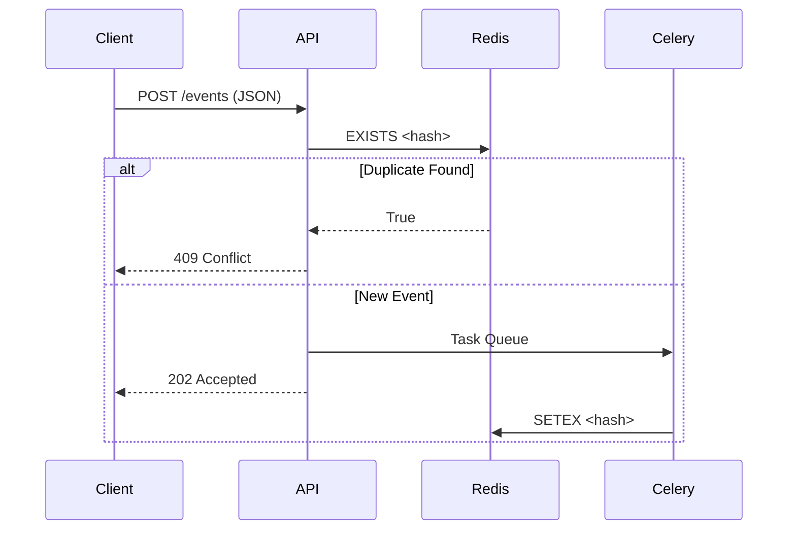

# Event Deduplication Service

[](LICENSE)

Real-time event processing system with Redis-backed deduplication and Celery task queue.

## Architectural Principles

### Core Concept
`GET` requests are significantly cheaper than write operations. To optimize performance:
- FastAPI handles lightweight hash generation and cache checks
- Heavy write operations delegated to Celery workers
- Immediate response to client without waiting for DB persistence

**Why this approach?**
```bash
+------------------------+----------------------+
|        Operation       | Relative Cost (CPU)  |
+------------------------+----------------------+
| SHA-256 Hash Generation|         1x           |
| Redis GET              |         2x           |
| Redis SETEX            |         5x           |
| Network Task Transfer  |         3x           |
+------------------------+----------------------+
```

### Deduplication Logic


## Features
- 7-day deduplication window
- Horizontal scaling with Celery workers
- Two operation modes: Dev & Load Test
- Built-in Postman collection (`Deduplicator.postman_collection.json`)
- Redis cluster support

## System Architecture
                      +----------------+
                      |  Client        |
                      +--------+-------+
                               |
                      +--------v-------+
                      |  FastAPI       |
                      | (Validation &  |
                      |  Hash Check)   |
                      +--------+-------+
                               |
                +--------------+--------------+
                |                             |
        +-------v--------+          +---------v---------+
        | Redis (Cache)  |          | Redis (Queue)     |
        | GET/EXISTS     |          | Celery Tasks      |
        +----------------+          +---------+---------+
                                              |
                                    +---------v---------+
                                    | Celery Workers    |
                                    | (SETEX with TTL)  |
                                    +-------------------+

## Prerequisites
- Docker 20.10+
- Docker Compose 2.20+
- Postman (optional)

## Quick Start

### Development Mode (250-300 RPS)
```bash
docker-compose up --build -d
```

**Components**:
- FastAPI application
- Redis ×2 (storage + queue)
- Celery worker
- Flower monitoring (Dev Mode)
- Locuct (Load Test Mode)

**Endpoints**:
- `POST /api/v1/ddup_service/events` - Process events
- `GET /api/v1/ddup_service/test` - Health check
- Flower dashboard: `http://localhost:5555`

### Load Test Mode (600+ RPS Scalable)
```bash
docker-compose -f docker-compose.loadtest.yaml up -d
```
**Optimizations**:
- 4 Celery workers (1000 concurrency)
- Redis memory tuning
- Locust GUI: `http://localhost:8089`

## Architecture Comparison
| Component      | Dev Mode               | Load Test Mode         |
|----------------|------------------------|------------------------|
| Redis          | 2 nodes, 2GB RAM       | Cluster configuration  |
| Celery Workers | 1 instance             | 4 instances, 1.5vCPU   |
| Concurrency    | Default                | 1000 prefetch          |
| Flower         | ✅                     | ❌                    |
| Locust         | ❌                     | ✅                    |

## Postman Integration
Import `Deduplicator.postman_collection.json` for:
- Preconfigured requests
- Example payloads

## License
MIT License - See [LICENSE](LICENSE)